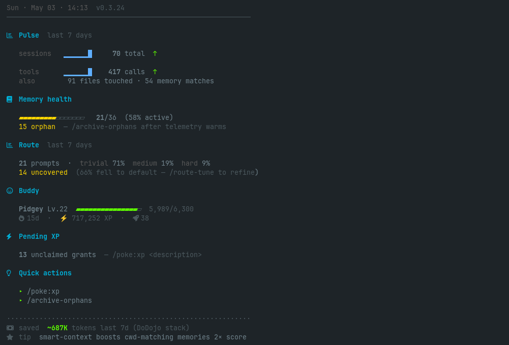

# Status — greeter pulse stats

The SessionStart greeter renders a compact status card at the top of every Claude Code session. `/dodojo:status` prints the underlying values without the banner chrome.

## Greeter banner sections



| Section | What it shows | Source |
|---------|--------------|--------|
| **Header** | Day · time · DoDojo version | local clock + plugin.json |
| **Pulse** | Sessions + tool calls (last 7d), files touched, memory matches | `~/.claude/sessions/*.jsonl` |
| **Memory health** | Active vs orphan memory ratio, prune nudge | smart-context telemetry + `~/.claude/memory/` |
| **Route** | Verdict mix (trivial/medium/hard %), uncovered % | `~/.claude/hooks/model-route.log` |
| **Buddy** | Pokemon level, XP, friendship, party size | `~/.claude/buddy-*.json` (pokemon-buddy plugin) |
| **Pending XP** | Unclaimed XP grants from prior sessions | `~/.claude/buddy-xp-pending.jsonl` |
| **Quick actions** | Top-1 suggested slash command this session | rule-based off pulse + memory state |
| **Footer** | Tokens saved last 7d + rotating tip | `session-summary` rollup |

## Triggers per section

- **Pulse**: always shown if any session this week
- **Memory health**: always
- **Route**: only if model-route hook fired ≥10 prompts last 7d
- **Buddy**: only if pokemon-buddy plugin installed
- **Pending XP**: only if unclaimed grants exist
- **Quick actions**: only when something noteworthy (e.g. >10 orphans, route uncovered >50%)

## `/dodojo:status` output

Plain table, no ANSI:

```
theme         frieren
icons         nerd
data path     ~/.claude
greeter mode  terminal
memory files  36
hooks (custom settings.json)  7
sensei        enabled (vault: ~/Documents/Obsidian Vault/Sensei)
```

## Tokens saved counter

The footer `~687K tokens last 7d` aggregates:

- Smart-context selective injection (vs loading every memory)
- Model-route picking haiku/sonnet over opus when appropriate
- Caveman compression (if installed) per-turn savings
- RTK rewrites (if installed) on shell output

Computed from `~/.claude/sessions/*.jsonl` rollups. Reset 7-day rolling window.

## Customize

- Disable greeter inject (saves ~400 tok/session): `KAGAMI_SILENT=1` — banner still renders to terminal via shell wrapper
- Disable banner entirely: `DODOJO_GREETER_MODE=off`
- Change theme/icons: `/dodojo:theme` + `/dodojo:icons`
- Banner-only render mode (no Claude inject): `DODOJO_GREETER_MODE=terminal` (default)

## Related

- [theme.md](theme.md) — change the greeter color palette
- [icons.md](icons.md) — change section markers
- [audit.md](audit.md) — drill into "Memory health" numbers
- [prune.md](prune.md) — act on orphan count surfaced here
- [sensei.md](sensei.md) — pending recs that surface in greeter
